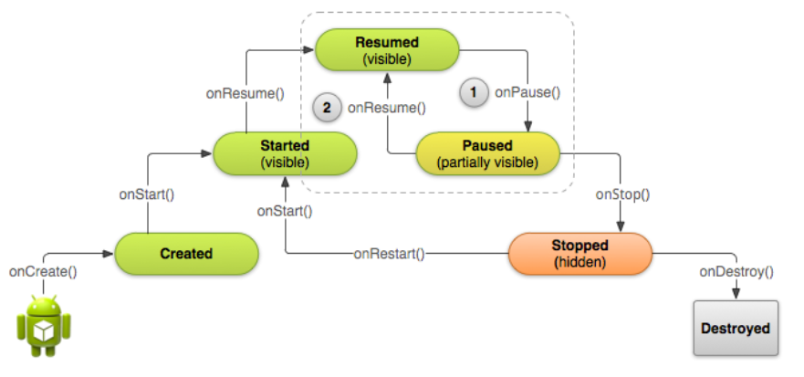
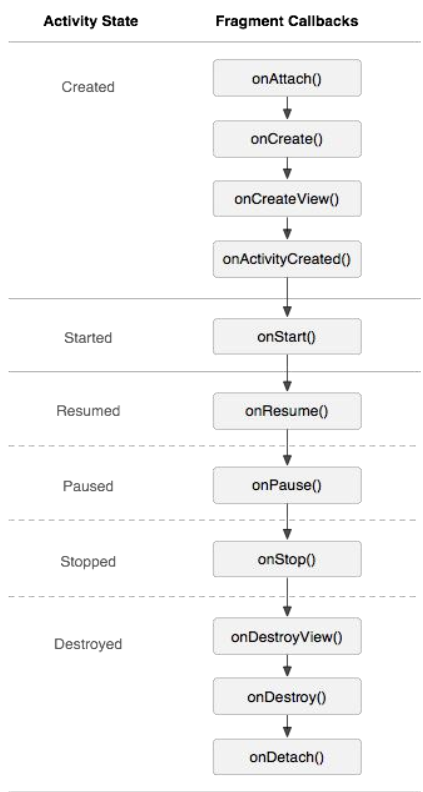
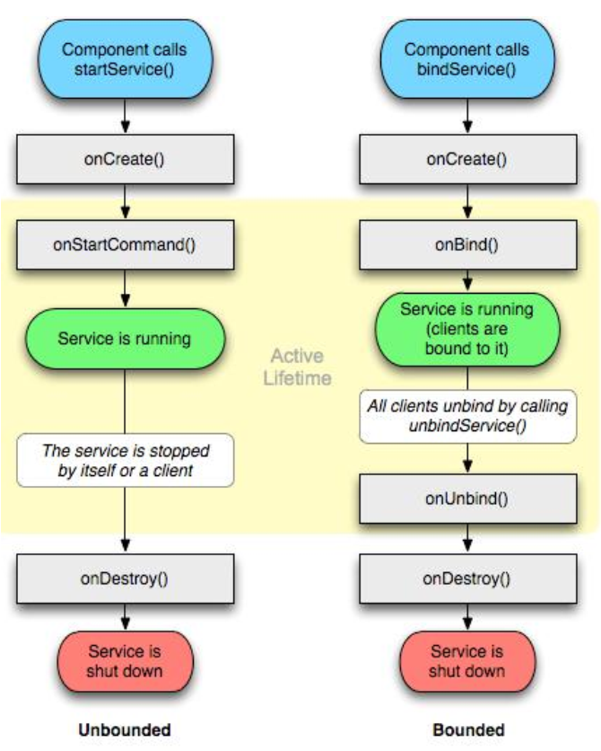

[TOC]


# 前言 

本书编写的**时代背景**，**针对人群**，**素材来源**，**主要内容**,**参与人员**，**编写历程**，**本书特色**，**鸣谢**。

# 第1章 关于面试

## 1.1 面试渠道

想获得一份工作，方式很多，但是具体到我们程序开发工作者，通常可以从以下几种方式中得到企业的招聘信息。

- 校招	

  通常是一些国企，或者是大中型互联网企业，会在每年的毕业季去到优质的高等大学招聘应届生。如果是软件或者计算机相关专业毕业，学校课程可以给你积累一些编程经验的话，校招是进入大企业的好机会。相信大家都还记得，前些年 人工智能AI 人才缺口巨大，各大IT巨头企业都去985，211大学疯狂抢人的新闻。好的学校，确实是好的平台。

- 招聘平台

  现有的招聘平台，比较出名的有 BOSS直聘，51Job，前程无忧，拉勾网，智联招聘，58同城，猎聘网，赶集网，等等。
  但是，就靠谱性而言，比较贴合 程序开发的，只有BOSS和拉钩，其他的，就笔者以及周围朋友的经历而言，成功率较低。

- 内推

  如果在工作中积累了一些人脉，现同事，前同事，同事的朋友，前同事的朋友，都可以为我们提供有用的招聘信息。这类渠道，往往更加直接有效。他们熟悉你的能力，你也对他们充分信任，这类机会，不要错过。

- 猎头

  有时候上班，经常会接到来自某某公司的招聘顾问，其实就是猎头，他们替委托公司招聘针对性的专业人才。猎头这个词，原本指的是“高级人才寻访”，到了互联网领域，便没了什么高级不高级之分，有批量招聘的，也有特定岗位挖人的。猎头一般有自己的信息圈子，猎头之间信息互通，资源共享。

## 1.2 面试流程

如果通过面试渠道，得到了面试机会，一般会按照如下步骤进行面试：

### 电话/微信/短信/ 招聘app 邀约

邀约的方式分多种情况，但是一般招聘公司的HR会跟你约定好面试时间，地点，需要携带什么必需品。但是，专业的HR，会把第一次电话沟通作为第一次面试，她会询问你简历上的信息与你本人是否相符，你本人是否有面试意愿。因为，有些人是自动投递简历，有些招聘平台是自动匹配，有可能你简历投出去了，你自己都不知道。再由，通过电话确认，可以筛选掉一些明显信息造假，或者不符合公司要求的人选，避免浪费双方时间。

### 正式的电话邀约函

正规的公司再进行电话邀约之后，都会给求职者发送面试邀请，面试邀请应该提前写好，有统一的格式，一般情况下发送的时候只需要调整个人信息和时间即可。

面试邀请一般来讲要包含以下几个方面的内容：

1、求职者姓名、应聘职位；

2、面试时间、地点、路线图和乘车路线；

3、简单公司介绍和公司网址；

4、公司联络人及电话；

5、善意提醒和感谢。

### 填表

不得不说，有些信息明明简历上写了，还让你在面试之前再写一次。但是，从招聘公司的角度上讲，每个人的简历格式都可能不同，他们为了信息统一，让应聘者再次统一填写自己的关键信息到他们的表格里，是最省时的表现。作为求职者，不能忍，也要忍。

有些大企业，在你填写了自己的信息之后，HR还会跟你口头核对一遍。确保信息真实可靠。

### HR初面

到了对方公司，和HR的第一次面谈，主要会了解你的以下几个方面：

1、个人素质和个性；

2、工作经历及通用技能；

3、价值观是否和企业匹配；

4、个人的意向和职业规划；

5、薪资情况和期望

求职者的口头表述能力，事前准备工作是否充分，都会影响到这一轮面试的成败。

### 笔试/机试

某些公司会有笔试，主要是考察基础知识，比如面试的是安卓开发岗位，就可能在这个环节考察java基础，android框架基础等。机试一般很少，有机试的话，一般也是做几道编程题，考察临场编程能力。有一些特别的公司，甚至有结对编程环节，也就是面试官跟你共同解决一个问题，面试官代表的是公司，你代表的是你个人，这种结对编程的方式，是增进双方了解的高效方式。

### 复试

如果笔试通过，或者干脆没有笔试的话，从现在才是展现你自身专业素质的开始。这一轮的面试官，要么是你将来的的同事，或者是你将来的直接领导，他们将会就他们关心的问题，结合你简历上所写的工作经验进行针对性提问，所以，简历写的怎么样，将会大大影响这一面的成败。这个阶段重点考察以下几个方面：

1、个人知识和技能考核；

2、工作匹配度考察；

3、与部门人员接触，适应；

4、团队与合作意识。

一般情况下职位比较高的求职者还需要再进行多轮的面试，总监、高管职位通过部门的面试之后，还需要公司高层领导的面试。这个阶段都可以归纳到复试阶段，所有的复试都完成之后才能确定是否录用。

### 确定录用

通过以上多重考察和面试的人选，就进入了是否确定录用的考察范围，通常情况下要将几轮的面试结果汇总，如果职位比较高或者核心岗位人员，还应该让当时的面试官一起商量面试的结果和想法，大家一致认为没有问题方可录用。

确定录用之后要先给求职者一个口头的电话通知，随后发送正式的录用通知书，进行后续的录用工作，谈薪流程往往也是放在最后的。

但是实际的面试过程中，往往会因为公司体量大小不同，制度不同，招人的急迫程度不同，可能会多出一个步骤或者省略一个步骤，上述过程仅供参考。

## 1.3 个人简历

个人简历是每个人的门面。一份干净整洁，仅仅有条的简历在面试之前就能给别人留下一个很好的印象。书写简历，务必注意以下几点：

### 信息全面不冗余

通常一份完整的简历，必须包含：个人基本信息（非常容易忘的是联系方式，手机号，邮箱最好都留下）。

工作经历，倒序书写，从最近的工作，到最开始的工作。这里比较容易犯错，有些人把工作经历和项目经历混在一起，有些大企业，流程比较规范，HR对于简历的要求也很高，他们需要整理面试者的工作经历时，如果翻了好几遍简历都整不明白，可能就会把你pass。

项目经验，倒序书写。最近一两个项目经验最好是写详细一点，因为这个很可能成为被面试官重点提问的地方。

教育背景，你毕业于什么大学，是否全日制，起始时间/结束时间。

职业规划和自我评价，这个影响到HR对你的个人素质的基本判定。如果职业规划没写，自我评价又不知所云，被筛选的几率很大。

### 针对性突出重点

面试者自身的能力，自己很清楚，但是有些人往往投了简历就像石沉大海。很有可能时由于简历的针对性不够. 解决方式也很简单：

针对岗位要求，书写特定词汇。

要知道，筛选简历的往往是HR，他们不懂技术，但是他们会拿着技术部门提出的技术要求跟你的简历进行核对，有些同义词，近义词，我们做技术的明白，他们不明白，他们就以为两者毫不相关。更有甚者，有些公司筛选简历是用的电脑程序，那如果词汇对不上，就更容易被筛掉。为了避免这种不必要的误会，我们在投递简历之前，先把对方公司的招聘要求和自己的简历放到一起对比以下，看自己简历上是否有些词汇可以替换成他们要求的技能名字，甚至可以把这些关键字加粗加黑，提醒HR，我懂这个，”选我选我“！经过这样整改之后的简历，被HR或者电脑程序选中的几率就大很多。

### 不要浮夸

写简历切记过于浮夸，比如说明明只是负责了一个小模块，非要夸大成，我是这个系统的主程。这种夸大其词，往往在技术面试官手上走不过一个回合就被打回原形，并且落了一个不诚实的印象。没必要，找工作，找的是合适自己的岗位，就算面试蒙混过关骗到了高薪，工作中，才不配位也很容易漏出马脚。

### 适当润色

不浮夸是必须的，但是适当润色，也是可以理解的。比如人尽皆知的“熟悉”，“精通”。什么叫熟悉，什么叫精通，在我们自己眼里，能够熟练使用，无需借助度娘谷歌，这个叫熟悉。脱离网络，可以随意编程，并且对于某些技术有自己独特的观点，这个叫精通。很多公司的招聘要求中，熟悉指的是无所不能，精通指的是 超凡脱俗，开天辟地，天下无敌。他们的理解往往比我们自身的层次要高。但是这个仅仅是针对外行人，内行人都知道，简历上写的精通，往往就是 我们的“熟悉”。

所以，简历上，不妨对我们自身的能力进行拔高，这样，既能给HR一个好的印象，又不至于在技术面试官手上太过于伪装。但是一定要注意度，润色不是造假，拔高层次不要高太多。

### STAR法则

STAR法则,即为**Situation Target Action Result**的缩写，具体含义是:

Situation: 事情是在什么情况下发生

Target 你是如何明确你的目标的

Action: 针对这样的情况分析，你采用了什么行动方式

Result: 结果怎样，在这样的情况下你学习到了什么

简而言之，STAR法则，就是一种讲述自己故事的[方式](https://baike.baidu.com/item/方式/3616191)，或者说，是一个清晰、条理的作文模板。不管是什么，合理熟练运用此法则，可以轻松的对[面试官](https://baike.baidu.com/item/面试官)描述事物的逻辑方式，表现出自己分析[阐述](https://baike.baidu.com/item/阐述)问题的清晰性、条理性和逻辑性。

使用STAR法则，至少有两个好处：

- 让你在描述一件事情时条理清晰，语句精简，重点突出，闪光点明确
- 更容易让面试官感觉到数据量化的成果，因为数据化之后，别人会更加直观地感受到你在这项工作中扮演的角色，产生的价值

举个例子，一个正确的Star法则描述你的项目经验：

**情境 Situation**：接手项目时，由于前任大量冗余代码，垃圾代码地堆积，造成app启动速度超过2秒，感觉很慢，界面切换不流畅地不良用户体验

**目标Traget**：一个app时卡住超过1秒，就会让人有想关掉的冲动。所以必须把启动速度优化到至少1秒之内

**行动Action**：利用专业工具adb的测算，当前启动时间为2090毫秒。我经过代码的细致分析，对app启动时的耗时任务进行分门别类，保留了必须随启动而进行的任务，其他任务放在子线程异步运行，或者在特定界面进行初始化，降低了启动页面上主线程的。同时，对主界面的布局，列表布局进行平面化改造，降低布局层次，加入延迟加载ViewStub等技术，进一步加快启动的视觉感官上的速度。

**Result结果**：再次用adb测算启动速度，这次启动只花了300MS，同时app的正常功能没有受到影响，主界面渲染的感受也更加流畅。

除此之外，如果想进一步拔高自己的思想层次，可以在STAR之后再加上一个T（Thinking）反思。

**Thinking反思**:

- **这件事情我哪里做的好？**

- **哪里做的不好？**

- **不好的地方是因为什么？**

- **下次如何改进？**

- **这个经历我以后还可以复用在其他的什么场合？**

但是这个反思的过程不要写在简历上，而是要默默准备，面试代用。因为，当面试官看到你STAR仅仅有条的描述之后，会针对性提问，这个时候， 你把准备好的反思过程跟他详细讲讲，会让面试官觉得，你的表现超出他的预期，算是意外收获，可以增加印象分。


## 1.4 面试心态

### 每一次面试都是一次博弈	

面试者想要找一份 钱多，事少，离家近的工作。企业想要找一个 薪资要求低，能力强，任劳任怨的员工。公司想尽可能削减成本，但是又想让企业收益提高。我们想要更多工资，又不想无偿付出太多。这本身就是矛盾的。在某种程度上来说，面试者和企业本身就是利益对立的关系，但是社会的正常运转，又迫使双方密切合作。所以，面试，本身就是一场你死我活的斗争，一场没有硝烟的心理博弈。刚刚毕业的时候，可能还想着找一个公司工作，像家一样温暖。但是出社会几年多了，还留有这样的幻想，就实属不太成熟。面试的全过程，都要把对方公司当成“敌人”，“对手”来分析，知己知彼，分析对方的痛点，也就是对方的迫切需求点，然后分析自身的能力能否满足他们的需求，如果可以满足，那你的这方面能力就是你最后谈薪的筹码。

### 面试是双方互相选择的过程

可能有人觉得自己面试了N家公司，但是没有一家发offer的，于是开始灰心丧气。其实大可不必如此。因为，公司不给你发offer，不只有你能力不合格这一个原因，还有可能是：薪酬要求过高，能力太强驾驭不了，公司内部临时决定取消招人计划，等等其他各种原因。

在与技术面试官聊过之后，如果觉得你技术还行，对方往往还会问你一句：**你还有什么问题想要问我的么**？

这个时候，不要慌，这是一个你了解对方的好机会，因为面试官很可能也是你未来的同事，或者直接上级。挑选你最关心的问题，但是不要显得太急功近利，比如五险一金这种问题，可能技术面试官自己都不太清楚，如果他说他不清楚，可能要去问HR，这时候就不要继续追问这个了。提供几个万金油的问题：

1. 您一天的工作是如何进行的，几点到公司，几点吃饭，几点下班，平时公司有什么团建，或者集体活动等。

   以闲聊的方式了解对方公司的氛围，可以拉近和面试官的心理距离。注意，加班问题不要随便问，这是定时炸弹，你回答不好就直接OVER了，上面的提问，如果面试官心情好，会顺便告诉你公司的加班情况。

2. 贵公司有没有薪酬激励机制，薪酬结构是怎么样的

   我来面试就是想多赚钱，不关心钱是不可能的，但是不能提问太过俗套，直接问你们最多能给我多少薪水，这种方式会给技术面试官带来反感，而且这也不是他能决策的问题。而问薪酬结构，以及激励机制，就专业的多。

3. 如果有幸入职贵公司，我会负责什么工作内容

   这是加分项，说明你对他们公司基本认可，现在了解工作内容，可以更清晰地让双方知道，对方是不是自己要找的。

4. 为了胜任这份工作，您认为我还有什么需要学习的

   加分项二，说明你不仅仅对他们岗位感兴趣，而且你是一个积极上进的员工。

除此之外，还可以问：

赢得这个岗位需要几轮面试?接下来的流程是什么?团队成员有多少人?大家怎么分工?目前团队的核心工作是哪些?

如果我来到公司之后，每天的日常工作是什么?公司对我这个职位的期望是什么?如何评估员工在试用期间的表现?考核标准是什么?

特别注意：**这些回答不可取**

1. 我没有问题了

   这说明你对他们公司不敢兴趣，或者你对他们公司一点都不了解，没有什么可以直接提问的话题，无论哪一点都会给你减分。

2. 薪酬，加班的问题

   这些问题，直接问上去就是自讨没趣。非要问的话，夹带在其他问题里侧面提问。而且，这类问题往往是技术过关，最终谈薪的时候才会涉及。技术面试就不要提这个问了。

### 学会换位思考

**首先**,**企业面试你，其最终目的就是为了在面试者中寻找到能力、品行、个人价值观、职业期望与岗位相符的人才。其目的应该是”甄别"，而不是""淘汰"。**

一个成熟的面试官，所做的事情，应该是围绕挖掘面试者的优点，长处，或者说能够对当前岗位需求产生积极作用的能力，在面试过程中短短的2个小时以内，能够了解到的信息十分有限，所以面试官也在争分夺秒，所问的问题也是极其谨慎的。

如果以“寻找缺点”的心态来衡量是否要淘汰面试者，虽然能够提高面试的“速度”但不一定能够增大面试的“效率”，因为潜在的合适人选很有可能在某一个小的“意外中”被面试官当作一个“缺陷”予以淘汰，但事实上这样的“意外”只是由于面试者当时的心态、状态等偶然造成的，草率的淘汰往往就会错失一些“运气并不那么好的”优秀人才。

相反，当以“发掘优点”的心态来考察面试者，能够给予面试者在面试过程中的一些错误更多的宽容，也就有机会才能在有限的时间内让面试者更多的机会展现自己的长处。在一定容错率的前提下，我们才能更充分看到一个面试者的最真实的水平和能力，这时再将观察到的结论与企业的期望来匹配，才能得到更客观的面试结果。

**其次，当“发掘有点”营造出宽松的面试环境，事实上会更有助于发现面试者的“缺陷”。**如果面试者重视一场面试，他会表现的格外小心。

一方面他会尽可能的精心包装自己的优势和长处，同时也会竭尽全力的隐藏或者修饰自己的缺陷或弱点。而在一个严肃、紧张的面试气氛中，这样的状态很有可能会持续整个面试过程。因为在这样的环境下，面试者会因为压力和不安全感显得更加警觉，从而将自己不想被看到的一面隐藏的很好。

但相反，如果面试官表现出对面试者关注的信号，那么面试者在面试过程中逐渐觉得宽松和稳定，安全感的使然会让其不经意的放下警惕和精心准备的伪装，从而自然而然的表现出一些日常的行为习惯，那么也就更有可能将面试者的人品、素质看的更为真切。

**再者，一个开放的面试氛围也在一定程度上塑造了良好的企业形象。**现在的企业和求职者的关系是一个公平的市场供需关系，面试官在挑选人才的同时，企业也在被人才挑选。因此在面试过程中，企业所能传递给面试者的良好信号也决定着面试者最终是否会选择企业。

当然，某一些岗位会要求应聘者有很高的抗压能力或危机处理能力。在这样的情况下，面试的过程会需要一些“压力面试”的环节或者“挑战”环节。但这一过程仍然只是一个手段，面试官的目的仍然是希望通过这样的场景寻找出哪一些拥有强大心理素质和优秀应变能力的人。

当然，也存在一些专门出难题来难为面试者的公司，他们显然是缺乏招聘诚意，或者他们的面试官极其不专业，用难到别人来满足自己的优越感，满足感，如果你真的遇到了，还是敬而远之吧。

如果以理性思维来分析面试官的心理活动，再回到我们面试者，我们应该：

- 将面试看做展示自己能力的机会，充分的抓住一切能够展示自己长处的机会
- 不要惧怕面试过程中面试官的挑战，他的初衷不一定是对面试者的质疑，而是提供的另一个展现长处的机会
- 不要害怕面试过程中的微小错误，一个健康的面试应该是可持续而动态的，尽可能继续将焦点关注在后续的表现上
- 接受面试也是观察企业的一个过程，最终没有被企业录取可以是因为主动选择了不接受与自己文化认同差异过大的行为


## 1.5 面试官为什么会关心你的私人问题

如果面试官问你：

你有女朋友吗？你女朋友在哪？你女朋友做什么工作的？在哪儿工作？

你是否觉得他在窥探你的隐私？很反感对么？是的，没错，他就是在窥探你的隐私，毋庸置疑。但是他窥探的目的，并不是为了自己的某种奇怪的欲望，而是公司需要了解你的工作稳定型。

- 反面极端案例

  如果你回答，有女朋友，外地人，女朋友和你都是外地人，女朋友是无业游民。说实话，这种人才，就算能力再强，用人单位心里也会打鼓，不敢随便聘用。原因只有一个，那就是 你会不会因为女朋友不开心就罢工，又跳槽换个工作。而且，你这么一个人才，为什么会找一个无业游民女朋友，你肯定有其他缺陷没告诉我们。不好意思，你不太适合我这个岗位。

- 正面回答

  我有女朋友，是个老师，能很好的照顾我的生活，我能够百分之百的投入工作。这就会让面试官觉得，你能够在岗位上花很多的精力，为公司创造更多的效益。

当然，这个不是让你为了工作而说谎，有些不方便明说的话题，你隐晦一点讲，不要轻易就暴露了自己的短板。

## 1.6 如何优雅谈薪

### 1.6.1 典型错误

4种错误表述：
1. 我相信公司很正规，一定会根据我的能力给到一个合理的薪酬。
2. 我对薪水没有很高的要求，能够负担我的生活即可。
3. 我现在无所谓，更重要的是锻炼自己的能力。
4. 我没有想过这个问题，工作机会对我更重要。

只弹感情不谈钱：

1. 北京生活压力很大，当然越高越好。
2. 我刚和女朋友一起来背景，她还没工作，我希望薪酬可以有比较高的涨幅。
3. 我真的太喜欢你们公司了，我特别想来，我可以不要薪水。

不专业:

1. 大家都说跳槽至少要涨幅30%，所以我最少也要30%
2. 我毕业时就顶下幕布奥工作五年，月薪3W，现在5年了，我希望有3W.
3. 希望薪水翻倍，或者我期望50%，甚至提更高的要求，但是不能给面试官合理的解释，
4. 在开始提及换工作的时候，说到更看中的是更好的工作平台，更好的发展机会，薪酬不重要，但是后来谈到薪水，又给出了一个非常高的预期。
5. 提到薪水，就表现出不太好意思，紧张，局促。

### 1.6.2 企业定薪的基本逻辑

上面三种都是错误示范，那么在了解正确姿势之前，先了解一下 企业是如何制定薪酬制度的。

1. 正规的公司都会有自己的薪酬结构，比如，常规的互联网公司会有产品，运营，技术三类岗位，每个岗位里面会有不同的职级，每一个岗位的每一个职级都会有不同的薪酬范围。一般情况下，在企业决定招聘的时候，就会明确它需要的是一个什么样的岗位，什么样的职级，比如，岗位：Android开发岗 =>安卓高级开发。而这个职位，已经有了它自己的薪酬范围，比如15-18K。 
2. 企业在筛选简历的时候，会对对应到这个岗位，这个职级的需求来进行匹配，筛选，经过了筛选的简历才能进入面试。面试中，会对面试者进行评估，是否符合当前岗位需求，符合度是百分之多少，可以在薪酬范围内给到哪个具体数值。请注意，企业给面试者定薪，是根据企业自身的薪酬结构来的，而不是面试者的薪酬经历。用这样的逻辑，可以最大程度的保证公平性，每一个面试者自己都带有不同的历史薪酬，而且参差不齐。如果按照面试者的薪酬来估量，那么企业薪酬无法管理。


### 1.6.3 TotalPackage包含什么

TotalPackage=薪酬总包，也就是你在这家公司可以获得的直接收入的组成部分。比如，总包分为：现金+非现金。现金部分，又分为固定部分和非固定部分。固定部分指的就是常规的固定月薪。非固定部分，包括年底奖金，季度奖金，或者等同于绩效奖金的最终数字。非现金部分，包含 诸如分红，股票，期权，有一些公司会有各种各样的福利，好一点的会有公寓住宿，配车。这些也算是总包的一部分。

同时，总包还分为短期所得和长期所得。短期，就是当下，这一次offer当中所包含的所有内容。长期：就是进入这家公司之后，薪酬方面未来的成长性。比如，年度调薪方法，员工薪酬激励机制，员工配股，所有职业一切都会影响到你在这家公司的最终收益。

### 1.6.4 合理地“狮子大开口”

有的公司并不怕你开高价，狮子大开口。怕的是，你开了高价，但是自己不值这个价钱，浪费双方时间。这其中有一个重要概念，价值的稀缺性。

有的人面试中提出了很高的薪水要求，或者很高涨幅，但是却不能告知面试官自己能给公司提供怎么样的价值，并且这个价值还必须是公司目前就需要的。这个就是价值的稀缺性。物以稀为贵，能力也是价值的一种。

面试求职，企业招聘，简单来说也就是市场的供求关系。像一些朝阳产业，发展迅速，人才需求量高，在这个行业的发展初期，往往人才储备跟不上需求，这个时候，这种人才的薪酬就可能定的比较高。比如，大城市的互联网行业，根本不怕你开高价，他们绝对给得起。

又比如最近兴起的物联网行业，要求IT人才既有技术能力，又要有传统行业的相关知识积累，这种行业的发展初期，同样也是人才储备跟不上发展需求，薪酬也会定的比较高。

### 1.6.5 谈薪地正确姿势

回顾一下上文，3个基本概念：

1. 企业定薪的基本逻辑
2. totalPackage总包
3. 价值和价值稀缺性原则

总结一下得出以下结论：

1. 我们不需要担心面试中说出薪酬期望会有什么不良后果，企业有自己的薪酬结构，有它自己的考量。
2. 我们给出的薪酬期望必须有理有据，最核心的就是你能给公司和这个职位带来什么样的价值，这个价值就是市场对你个人能力的认可。
3. 你所提及的薪酬期望，不仅仅是月薪，而是totalPackage总包。

基于这几点结论，如果面试官询问，你对薪酬有什么要求，分以下3个步骤来回答。

1. 先询问对方公司的薪酬结构。
2. 在得到对方薪酬结构之后，不要着急回答，而是继续问他们的薪酬成长空间。
3. 基于以上两点综合考虑当前和未来的发展的可能性，尤其是在你的期望薪酬相较于现在有较高涨幅的时候，建议你主动去提出给你这样薪酬涨幅的原因。

这样的回答方式，不仅显得你很专业，而且主动性强，成功率更高。

### 1.6.6 案例：手把手教你和HR谈薪

下面说一个实际案例，一般到了谈薪的阶段，都是技术面试OK的前提下，所以这个时候，要不卑不亢，大胆谈薪。谈薪一般是HR负责与面试者沟通。

HR：你对薪酬有什么要求？

我：您公司的薪酬结构是什么样的。

HR：我们公司有12个月的月薪，年底3到6个月的奖金，同时，给一部分员工期权激励。

我：年底3-6个月的奖金是如何发放的呢，什么样的人可以得到3个月，要拿到6个月应该怎么做，是否存在一个月都拿不到的情况，奖金的发放时间是春节期间一次性发放，还是一年分多次发放。

HR: 通常最少都是3个月，全年绩效全优有可能拿到6个月，年底统一发放，不满一年的按照当年工作月数计算。

我：（继续追问）员工在公司会不会有什么样的薪酬调整，是以什么方式进行调整，以什么为调整依据，调整的比例和空间是什么样子，如果能力能够胜任更多职位，更多工作，是否有升职空间.....

HR: (...省略)

我：（基于上面HR的回答，相信心里已经有了数，如果HR仍然很热情，可以继续追问当前收益和未来收益，现金收益和非现金收益....）

HR: (...省略)

我：（基于以上所有的对于对方公司的薪酬结构的认知，可以开出自己认为合适的价格，如果价格较高，必须给出合理的理由）。


除了以上这些基本套路之外，我们的谈薪时的状态，应该是一种合作谈判，而不是你单方面在乞求他收留你。任何合作都是基于共赢，如果我们能给到对方需要的价值，那么对方也不会吝惜给予我们开出的薪酬。专业的谈薪资是可以让我们说话有理有据，并且让对方感受到你的自信和专业。

### 1.6.7 如何了解自身的价值

判断你现阶段在行业内值多少钱，我们可以做以下3件事情。

1. 对自己能够提供的价值有清晰的认识，梳理一下在过去的工作经历当中，我们主要达成的成就，这些成就里面我们都积累了什么样的能力，在哪些能力上有提升，达到了什么样的水平，和同事相比，你在什么层次。

2. 做一个基础调研，了解和我们做类似工作的人在市场上的薪酬情况。有这些方向可以去落实。

   - 自己当前的薪水，自己当前公司的薪酬成长情况
   - 同类工作的同学朋友的薪酬情况
   - 网上招聘广告薪酬信息
   - 参考大型公司的薪酬制度
   - 通过个人渠道了解市场的薪酬水平，比如**猎头**

   基于这几个渠道，做好调研，基本上能够对自己的薪酬汇报得到一个清晰的认识。

3. 了解到自己价值的稀缺性，你所在的行业是不是朝阳行业，你身上的技能是不是行业稀缺的，预估一下行业的人才储备，这个专业有多少同学，每年有多少毕业生，这个行业有多少公司，每年的校招是否很激烈，之前的同学和同事离开公司之后都去往什么样的公司，去往什么样的职位，他们在公司得到什么样的认可，他们所在公司的业务发展前景如何。同时，可以找找这些公司的职位开放的数据，这些是公开信息，我们可以查到这些公司在招什么样的岗位，需要多少人数。除此之外，我们分析一下自己是否具备一些非常规的能力（“绝活”）或者复合型的能力（既懂技术又懂传统行业）。这些特殊能力，也是你自身价值的体现。

### 1.6.8 HR压工资怎么办

如果HR给出的薪酬待遇不满足我提出的要求：

1. 询问原因，基于对方原因的基础上，有的放矢地采取行动

   举个例子：对方提到薪酬是基于面试结果，他们评估你在某一项能力上有所欠缺，如果基于你自己的了解，你觉得自己的这方面并非他们所说的那样欠缺，这就可能是因为面试的原因有点短暂，没有机会去展现，这个时候可以去争取一下去展示这方面的能力。

2. 从totalPacakge角度计算，评估 现金 非现金部分，短期和长期部分

   如果当前的薪酬不能满足你的期望，但是未来的成长空间比较大，这种机会可以综合考量。

3. 评估你对下一份工作的各项诉求的优先级

   你的薪酬是最高优先级，还是公司平台，未来发展，未来可能接触到的社会资源，这些也可以综合考量。如果这份工作，给你带来的不只是当前薪酬，还有岗位能给你带来的能力积累，这项能力又是你特别期待的，它能够在未来带给你特别的提升。这种情况下，可以考虑接受这样的机会，着眼未来。

4. 通过入职后快速证明自己。

   面试是一个短暂的过程，对双方来说都非常有限。经过当前的考虑，选择接受，但是可以向HR提出，是否可以在入职之后表现出自己的综合实力，如果超出他们的预期，是否可以有薪酬调整的空间，某些公司存在这样的空间。

### 1.6.9 谈钱不伤感情 

总结一下，如何才能谈钱不伤感情。

本节内容介绍了3各基本概念，第一个是 企业定薪的基本逻辑，希望借此帮助大家建立起管理者视角，思考自己是如何被定薪的。第二个是totalPackage，希望大家不仅仅是关注当前收益，也要关注未来的成长空间。第三个是，价值和价值的稀缺性，希望大家在思考薪酬的时候能够回归本质，分析自己身上的各项能力，这些能力代表的价值是否容易被替代，同时也要放开眼界，看看你所在的行业未来能否快速成长，看看这个行业内的人才储备情况，行业内人才的能力水平，还有你在这个行业内的位置。

## 1.6.10 学员面试案例

- 案例1

  ...

- 案例2

  ...

- 案例3

  ...

# 第2章 Android开发者的成长阶段

## 2.1 0-1年入门

技能：
 1.基础的组件的使用，熟悉Java基本的语法，Gson，xml数据解析
 2.第三方框架的使用，熟悉android的常用API，熟悉网络框架或者API的使用
 3.掌握数据库相关知识点，熟悉android的四大组件、生命周期，熟练掌握界面布局
 4.了解android项目目录的组织架构等等；

## 2.2 1-3年中级

技能：
 1.了解android的签名机制（实现原理，具体操作等等），打包机制（多渠道打包，打包流程等等）
 2.了解apk安装文件压缩（压缩图片，代码压缩，.so文件压缩等等），事件分发，View绘制流程，webview相关知识点（与Native的交互，性能优化等）
 3.熟悉数据库的使用（基本API，第三方ORM框架，ORM框架的实现原理等等），java反射原理与简单实践等
 4.activity的启动模式，activity，service，fragment，broadcastreceiver广播生命周期，屏幕适配，AIDL与messager的简单实用
 5.自定义组件（自定义View与自定义ViewGroup），动画（补间动画，帧动画，属性动画），通知栏消息，版本新特性等等等等；

## 2.3 3-5年高级

 技能：
 1.手动编写框架，设计模式，代码规范，项目进度，时间估算
 2.启动流程，性能优化，OOM，没存溢出与泄露，JNI，脚本开发
 3.activity启动流程，android中的IPC机制（Binder原理），对iOS现学现用等等；

## 2.4 5-7年 资深（或架构）

 技能：
 1.开源框架
 2.360°全方面性能调优
 3.NDK模块开发
 4.Hybrid 开发与Flutter

## 2.5 关于个人职业规划


# 第3章 数据结构与算法

**av老师**

## 3.1 为什么有的面试官爱问数据结构和算法?

## 3.2  常用的数据结构和算法有哪些?

## 3.3 数组相关面试题

## 3.4 链表

## 3.5  队列&堆栈

## 3.6 二叉树

## 3.7HashMap

## 3.8 图

## 3.9 排序算法

## 3.10 查找算法

## 3.11 串

## 3.12 如何评估一个算法的时间和空间复杂度

## 3.13 其他知识

### 3.13.1 加密算法

### 3.13.2 ...

# 第4章 Java基础面试题

## 4.1 Java基础对于Android开发人员的重要性

## 4.2 常见面试题...

# 第5章 Android体系

## 5.1 四大组件

### 5.1.1 Activity必问（含Fragment）

#### 什么是Activity，描述一下它的生命周期

**这道题想考察什么**?

开发了android N年，对Activity应该有很深刻的认识，如果只知道回答生命周期，未免太浅薄。如果能回答一些项目中使用过的Activity相关的实用技巧，加分。

**细分下来的知识点**

1. 对Activity的整体认知
2. Activity的生命周期

**如何作答**

1. Activity是android四大组件之一,一般的,一个用户交互界面对应一个 activity。通常用setContentView() 方法设置要显示的布局. Activity 是 Context 的子类,同时实现了 window.callback 和keyevent.callback, 可以处理与窗体用户交互的事件.

2. Activity 从创建到销毁有多种状态，从一种状态到另一种状态时会激发相应的回调方法，这些回调方法包括：onCreate-> onStart-> onResume-> onPause-> onStop->onDestroy. 从onStop恢复到onStart要经过onRestart. 

   其实这些方法都是两两对应的，onCreate 创建与 onDestroy 销毁；onStart 可见与 onStop 不可见；onResume 可编辑（即焦点）与 onPause；

***

#### onStart 和 onResume， onPause 和 onStop 差不多， 但是又有什么本质的不同呢？

**这道题想考察什么**

Activity 拥有不同的状态，生命周期方法纯粹是 这些状态改变之后的回调。这道题考察你对Activity状态的理解。

**细分下来的知识点**

1. 状态有哪几种
2. 回答onStart和onResume的区别，onPause和onStop的区别
3. 如果能答上某些特殊情况下的生命周期函数的调用方式，加分

**如何作答**

1. **Running**状态：一个新的Activity启动入栈后，它在屏幕最前端，处于栈的最顶端，此时它处于可见并可和用户交互的激活状态。 **Paused**状态：当Activity被另一个透明或者Dialog样式的Activity覆盖时的状态。此时它依然与窗口管理器保持连接，系统继续维护其内部状态，它仍然可见，但它已经失去了焦点，故不可与用户交互。 

   **Stopped**状态：当Activity不可见时，Activity处于Stopped状态。当Activity处于此状态时，一定要保存当前数据和当前的UI状态，否则一旦Activity退出或关闭时，当前的数据和UI状态就丢失了。 

   **Killed**状态：Activity被杀掉以后或者被启动以前，处于Killed状态。这是Activity已从Activity堆栈中移除，需要重新启动才可以显示和使用。
   
   

2. onStart()和onResume()的区别

   onStart()是activity界面被显示出来的时候执行的，用户可见，包括有一个activity在他上面，但没有将它完全覆盖，用户可以看到部分activity但不能与它交互.

   onResume()是当该activity与用户能进行交互时被执行，用户可以获得activity的焦点，能够与用户交互。



3. onPause： Activity是去焦点，但仍然可见；

   onStop：Activity在后台不可见时触发（完全被另一个Activity挡住，或者程序在后台运行）

4. 场景：

   - 锁屏的时候户依次调用onPause()和onStop()

   - Toast，Dialog，menu ，三者都不会使Activity调用onPause();

   - 一个非全屏的Activity在前面时，后面的Activity只调用onPause();

   总结：  **Dialog不会调用onPause()和onStop()， 非全屏Activity会调用onPause()不会调用onStop()，全屏Activity 会调用onPause()和onStop()。**
   

***

#### 当从 A 窗口打开 B 窗口时， B 窗口的 onResume 和 A 的 onPause 方法哪个先执行呢？  

**这道题想考察什么**

这个实际上考察的是有没有自己去尝试测试过Activity的生命周期函数，如果仅仅是看出，简单地使用onResume函数，这道题是回答不上来的。

**细分下来的知识点**

1. A打开B，A自身的生命周期如何执行，B的生命周期如何执行
2. 从B回到A，又是怎么样的执行顺序

**如何作答**

1.启动 A
onCreate - onStart - onResume

2.在 A 中启动 B
ActivityA onPause
ActivityB onCreate
ActivityB onStart
ActivityB onResume
ActivityA onStop  

3.从 B 中返回 A（按物理硬件返回键）
ActivityB onPause
ActivityA onRestart
ActivityA onStart
ActivityA onResume
ActivityB onStop
ActivityB onDestroy

4.继续返回
ActivityA onPause
ActivityA onStop
ActivityA onDestroy  

上述是做过实验之后可以从日志里面直接得出的结果。经过总结分析得出：

从A到B时，A先pause，B必须要走完onCreate,onStart,onResume到了可交互的状态时，A才会交出控制权，到onStop。这样可以防止A过快消失导致用户看到B尚未就绪的尴尬状态。同样B回到A，也是要A走完onRestart-onStart-onResume，之后B才onStop。

形象一点理解，就是A-B的切换相当于舞台剧切换场景，幕布降下来之前，下一个场景必须完全就绪，不能是一个半成品状态。

***

#### 如何保存Activity的状态（状态即数据）

**这道题想考察什么**

Activity 的状态通常情况下系统会自动保存的，只有当我们需要保存额外的数据，或者在特殊的情况下保存数据，才是这道题问的精髓。

**细分下来的知识点**

1. 什么场景下Activity状态不用手动保存
2. 什么场景下必须手动保存
3. 重写哪个方法去保存数据

**如何作答**

一般来说, 调用 onPause()和 onStop()方法后的 activity 实例仍然存在于内存中, activity 的所有信息和状态数据不会消失, 当 activity 重新回到前台之后,所有的改变都会得到保留。但是当系统内存不足时, 调用 onPause()和 onStop()方法后的 activity 可能会被系统摧毁, 此时内存中就不会存有该 activity 的实例对象了。如果之后这个activity 重新回到前台, 之前所作的改变就会消失。为了避免此种情况的发生, 我们可以覆写 onSaveInstanceState()方法。onSaveInstanceState()方法接受一个 Bundle 类型的参数, 开发者可以将状态数据存储到这个 Bundle 对象中, 这样 即 使 activity 被 系 统 摧 毁 , 当 用 户 重 新 启 动 这 个 activity 而 调 用 它 的onCreate()方法时, 上述的 Bundle 对象会作为实参传递给 onCreate()方法, 开发者可以从 Bundle 对象中取出保存的数据, 然后利用这些数据将 activity 恢复到被摧毁之前的状态。需要注意的是, onSaveInstanceState()方法并不是一定会被调用的, 因为有些场景是不需要保存状态数据的. 比如用户按下 BACK 键退出 activity 时, 用户显然想要关闭这个 activity, 此时是没有必要保存数据以供下次恢复的, 也就是onSaveInstanceState()方法不会被调用. 如果调用 onSaveInstanceState()方法, 调用将发生在 onPause()或 onStop()方法之前。

***

#### 横竖屏切换时Activity的生命周期

**这道题想考察什么**

除了一般情况下的生命周期函数调用顺序之外，横竖屏切换，系统也会根据app的设置让生命周期函数的调用顺序有所不同。

**细分下来的知识点**

1. 如何配置横竖屏切换设置

**如何作答**

此时的生命周期跟清单文件里的配置有关系。

1．不设置 Activity 的 android:configChanges 时，切屏会重新调用各个生命周期默认首先销毁当前 activity,然后重新加载

2．设置 Activity android:configChanges="orientation\|keyboardHidden\|screenSize" 时，切换不会重新调用各个生命周期函数，只会执行onConfigurationChanged方法。

***

#### 如何退出一个Activity，如何安全退出已调用多个Activity 的 Application？  

**这道题想考察什么**

Activity管理不善，很容易导致内存泄漏，如果要确保不会泄露，开启了多个Activity的应用，如何关闭才万无一失。

**细分下来的知识点**

彻底退出app的方式有很多种，尽可能说出自己熟知的那些。

**如何作答**

1、通常情况用户退出一个 Activity 只需按返回键，我们写代码想退出 activity直接调用 finish()方法就行。

2、记录打开的 Activity：每打开一个 Activity，就记录下来。在需要退出时，关闭每一个 Activity 即可。

3、发送特定广播：在需要结束应用时，发送一个特定的广播，每个 Activity 收到广播后，关闭即可。

registerReceiver(receiver, filter)//给某个 activity 注册接受接受广播的意图//如果过接受到的是 关闭 activity 的广播 就调用 finish()方法 把当前的activity finish()掉。

4、递归退出

在打开新的 Activity 时使用 startActivityForResult，然后自己加标志，在onActivityResult 中处理，递归关闭。

5、其实 也可以通过 intent 的 flag 来实现

intent.setFlags(Intent.FLAG_ACTIVITY_CLEAR_TOP)激活一个新的 activity。此时如果该任务栈中已经有该 Activity，那么系统会把这个 Activity 上面的所有Activity 干掉。其实相当于给 Activity 配置的启动模式为 SingleTop。

***

#### Activity的4种启动模式，在什么情况下使用何种模式

**这道题想考察什么**

启动模式是谷歌提供的，让开发者灵活控制Activity栈的方式，在特定的场景下使用有奇效。

**细分下来的知识点**

1. 是哪4种，有什么区别
2. 什么场景下，用哪种刚好合适

**如何作答**

1. singleTop 跟 standard 模式比较类似。唯一的区别就是，当跳转的对象是位于栈顶的 activity（应该可以理解为用户眼前所 看到的 activity）时，程序将不会生成一个新的 activity 实例，而是直接跳到现存于栈顶的那个 activity 实例。拿上面的例子来说，当 Act1 为 singleTop 模式时，执行跳转后栈里面依旧只有一个实例，如果现在按返回键程序将直接退出。

2. singleTask 模式和 singleInstance 模式都是只创建一个实例的。在这种模式下，无论跳转的对象是不是位于栈顶的 activity，程序都不会生成一个新的实例（当然前提是栈里面已经有这个实例）。这种模式相当有用，在以后的多 activity开发中，常会因为跳转的关系导致同个页面生成多个实例，这个在用户体验上始终有点不好，而如果你将对应的 activity 声明为 singleTask 模式，这种问题将不复存在。在主页的 Activity 很常用。

***

#### Android 中的 Context, Activity，Appliction 有什么区别？  

**这道题想考察什么**

启动模式是谷歌提供的，让开发者灵活控制Activity栈的方式，在特定的场景下使用有奇效。

**细分下来的知识点**

1. 是哪4种，有什么区别
2. 什么场景下，用哪种刚好合适

**如何作答**

相同：Activity 和 Application 都是 Context 的子类。<br/>Context 从字面上理解就是上下文的意思，在实际应用中它也确实是起到了管理<br/>上下文环境中各个参数和变量的总用，方便我们可以简单的访问到各种资源。<br/>不同：维护的生命周期不同。 Context 维护的是当前的 Activity 的生命周期，<br/>Application 维护的是整个项目的生命周期。<br/>使用 context 的时候，小心内存泄露，防止内存泄露，注意一下几个方面：<br/>1. 不要让生命周期长的对象引用 activity context，即保证引用 activity 的对象<br/>要与 activity 本身生命周期是一样的。<br/>2. 对于生命周期长的对象，可以使用 application，context。<br/>3. 避免非静态的内部类，尽量使用静态类，避免生命周期问题，注意内部类对<br/>外部对象引用导致的生命周期变化。

***

#### 两个Activity之间传输数据，都有哪些方式

**这道题想考察什么**

传输数据的方式不止一种，除了常见的intent之外，说出开发中常用的方式。把自己熟悉的方式说得越完整，深度越深越好。

**如何作答**

1. 四大组件之间通信都可以用的intent
2. 注册广播接收者可以收到其他Activity发送的广播，广播也是可以携带数据的
3. 多个app之间Activity要跨进程通信，contentProvider可以轻松实现
4. SharedPreferences 首选项，其实它内部也是文件存储
5. 新建本地文件进行读写
6. 利用轻量级数据库sqlite
7. 文件存储的通信方式都有多线程异步读写的问题，包括SharedPreferences，所以特别敏感的数据慎用。


***

#### Context是什么？一个应用有多少个context

**这道题想考察什么**

Context上下文，学过安卓的都知道，但是context体系化知识，知道的人就未必很多了。这道题能答好，说明对android内核有自己的理解。

**细分下来的知识点**

1. context的概念
2. context的类继承结构

**如何作答**

1、它描述的是一个应用程序环境的信息，即上下文。
2、该类是一个抽象(abstract class)类，Android 提供了该抽象类的具体实现类（ContextIml）。
3、通过它我们可以获取应用程序的资源和类，也包括一些应用级别操作，例如：启动一个 Activity，发送广播，接受 Intent，信息，等。4、一个应用 Context 数量=Activity 个数+service 个数+1 个application

***

#### activity之间，以及activity和service之间，如何传值，能传图么？

**这道题想考察什么**

这道题考察常见开发场景中的数据传递具体如何操作。

**细分下来的知识点**

分情况说明：

1. Activity之间
2. Activity与service 之间

**如何作答**

1. Activity 之间的传值：startActivity，通过 Intent 对象的各种 putExtra 方法来进行传递。在第二个 Activity 对象中，可以通过 getIntent() 方法来得到跳转到这个 Activity 的 Intent 对象，然后通过 Intent 对象的各种 getXXExtra 方法来得到我们的传过来的值。

2. Activity 和 service 之间传值：

   在 activity 中通过 startService（intent）即可，同样 intent.putStringExtra()，然 后 再 service 中 的 onStart 函 数 中 获 取 该值,this.getIntent(),intent.getString()

   在这里我们需要在 Mainfeist 文件中注册这个 service

   <service Android:enabled="true" android:name=".Service"></service>

   service 可以从 public int onStartCommand(Intent intent, int flags, int startId)中取出从 activity 中传过来的值。intent.getExtra()获得 bundle 对象，可从中取值。

   activity 也可以用 bindService(intent, conn,BIND_AUTO_CREATE);传值，把要传的值绑定在 intent 里，在 service 的 public IBinder onBind(Intent intent) 方法里取得 intent。

***

#### Intent 可以传递哪些数据类型  

**这道题想考察什么**

考察你对intent的熟练使用，它能传递什么样的值，什么场景下适合用intent，什么情况下不合适

**细分下来的知识点**

1. intent的api已经说明了一切，支持基础数据类型，支持数组，支持实现了序列化serialzilable和parcelable的对象。

2. intent作为android组件之间传递数据的通用手段，泛用性很强，但也不是万能的

**如何作答**

来源：https://www.cnblogs.com/stars-one/p/8270667.html

1. 简单数据类型
2. 数组
3. 集合，list ， map都可以
4. 对象，可以将对象转成json字符串，或者实现java的serializable 或者 android的parcelable进行序列化
5. Bitmap也可以传，它本身就是实现了parcelable的.
6. 但是在多页面传导中不要使用intent，而应该采用全局化的数据仓库，比如 application类，作为context的始祖，app任何一处都可以获得它，从而拿到其中的数据。

***

#### Intent 如何传递大文件  

**这道题想考察什么**

考察的是 intent传递数据的容量限制

**细分下来的知识点**

1. 说明不能传输大数据的原因
2. 如果业务要求必须传递大数据，如何解决

**如何作答**

1. 在Activity或者组件之前传递信息时，一般采用intent绑定bundle的方式传值，但在使用过程中需要注意的是不要用bundle传递大容量数据。由于传递的数据量过大导致程序ANR，甚至直接报异常。这是由于bundle不能传递大容量的数据信息，Inetent、Bundle等传递数据时有一个缓冲区，而这个缓冲区最大只有1MB. 所以当数据量大时会出现android.os.TransactionTooLargeException。

2. 但是通常也有两种解决方式。

   方法一：将需要传递的数据写在临时文件或者数据库中，再跳转到另外一个组件的时候再去读取这些数据信息，这种处理方式会由于读写文件较为耗时导致程序运行效率较低；

   方法二：将需要传递的数据信息封装在一个静态的类中（注意当前组件和要跳转到的组件必须属于同一个进程，因为进程之间才能够共享数据），在当前组件中为类设置内容，然后再跳转到的组件中去取，这种处理方式效率很高，但是会破坏程序的独立性。

   具体采用哪种替代方式取决于具体的情况，一般建议采取第二种处理方式，因为这样会大大提高程序的运行效率.

***

#### Fragment 跟 Activity 之间是如何传值的

**这道题想考察什么**

考察常规开发中的多页面数据传递问题

**细分下来的知识点**

1. Activity和Fragment的关系
2. 如何优雅传值

**如何作答**

1. Fragment是作为Activity的子界面而存在的。当 Fragment 跟 Activity 绑 定 之 后 ， 在 Fragment 中 可 以 直 接 通 过getActivity（）方法获取到其绑定的 Activity 对象，这样就可以调用 Activity的方法了。

2. 在 Activity 中可以通过如下方法获取到 Fragment 实例:

   FragmentManager fragmentManager = getFragmentManager();

   Fragment fragment = fragmentManager.findFragmentByTag(tag);

   Fragment fragment = fragmentManager.findFragmentById(id);

   获取到 Fragment 之后就可以调用 Fragment 的方法。也就实现了通信功能。

总之两者可以获取到对方的引用，就能拿到对方的属性.

***

描述一下 Fragment 的生命周期

**这道题想考察什么**

考察Android基础，但是如果只是说说浅显的基础，那还不够

**细分下来的知识点**

1. 官网上关于生命周期的流程
2. 官网图上体现不出的特性

**如何作答**

理解Fragment的生命周期不要仅限于官网的图，必须要结合自身的使用经验来讲。



fragment被创建的时候，经历包含onAttach、onCreate、onCreateView、onActivityCreated方法；fragment对用户可见的时候，经历包含onStart、onResume方法；fragment进入“后台模式”的时候，经历onPause、onStop方法；fragment被销毁了（或者持有它的activity被销毁了），经历包含onPause、onStop、onDestroyView、onDestroy、onDetach方法；并且可用onCreate、onCreateView、onActivityCreated方法Bundle对象保存一个fragment的对象。

- **onAttach**：当Fragment与Activity发生关联时调用

- **onCreate**：创建Fragment时被回调，经历暂停或停止状态继而恢复后，想保留Fragment的基本组件，则在此进行初始化。

- **onCreateView**：首次绘制页面时候调用，在此可以创建View，也可以返回null，这样不建议耗时操作。

- **onActivityCreated**：Fragment绑定Activity，在onCreate方法已经执行完成并返回，在该方法内可以进行与Activity交互的UI操作，不能在此之前跟Activity进行交互。

- **onStart**：启动 Fragment 时被回调，此时Fragment可见，只是还没有在前台显示，因此无法与用户进行交互

- **onResume**：Fragment在前台可见，处于活动状态，用户可与之交互

- **onPause**：Fragment处于暂停状态，但依然可见，用户不能与之交互

- **onStop**：停止Fragment回调，Fragment完全不可见

- **onDestoryView**：销毁与Fragment有关的视图，但未与Activity解除绑定

- **onDestory**：销毁 Fragment 时被回调，通常按Back键退出或者Fragment被回收时调用此方法，此后接onDetach

- **onDetach**：与onAttach相对应，当Fragment与Activity关联被取消时调用

- **setUserVisibleHint**：调用次方法可以设置Fragment可见或者不可见。可以调用getUserVisibleHint()获得Fragment的可见或不可见状态，如果可见则进行懒加载操作

***

#### Fragment 的 replace 和 add 方法的区别

**这道题想考察什么**

使用Fragment经常会用到的几个api，效果不同，不能仅仅回答表面知识，能答到内核，加分。

**细分下来的知识点**

1. replace的内核实现
2. add show/hide  的用法

**如何作答**

Fragment 本 身 并 没 有 replace 和 add 方 法 ， 这 里 的 理 解 应 该 为 使 用FragmentManager 的 replace 和 add 两种方法切换 Fragment 时有什么不同。

我 们 经 常 使 用 的一 个 架 构 就 是 通 过 下方多TAB 切 换 Fragment(类似微信那种) ， 每个Fragment 就是一个功能模块:

Fragment 的容器就是一个 FrameLayout，add 的时候是把所有的 Fragment 一层一层的叠加到了 FrameLayout 上了，而 replace 的话首先将该容器中的其他Fragment 去除掉然后将当前 Fragment 添加到容器中。一个 Fragment 容器中只能添加一个 Fragment 种类，如果多次添加则会报异常，导致程序终止，而 replace 则无所谓，随便切换。因为通过 add 的方法添加的 Fragment，每个 Fragment 只能添加一次，因此如果要想达到切换效果需要通过Fragment的的hide和show方法结合者使用。将要显示的 show 出来，将其他 hide 起来。这个过程 Fragment 的生命周期没有变化。通 过 replace 切 换 Fragment ， 每 次 都 会 执 行 上 一 个 Fragment 的onDestroyView，新 Fragment 的 onCreateView、onStart、onResume 方法。基于以上不同的特点我们在使用的使用一定要结合着生命周期操作我们的视图和数据。

***

#### Fragment 如何实现类似 Activity 栈的压栈和出栈效果的？
**这道题想考察什么**

如果一个业务流程有多级页面需要来回切换，又不想耗费多个Activity，那么Fragment压栈出栈很合适。

**细分下来的知识点** 

1. Fragment栈的概念
2. 具体如何操作

**如何作答**

1. Fragment 的事物管理器内部维持了一个双向链表结构，该结构可以记录我们每次 add 的 Fragment 和 replace 的 Fragment，然后当我们点击 back 按钮的时候会自动帮我们实现退栈操作。 

2. 举例说明如何操作：

   - #### 准备工作

     1. 构造三个Fragment

     - Fragment1有一个按钮，可以跳转到Fragment2
     - Fragment2有二个按钮，一个跳转到Fragment3，一个回退到Fragment1
     - Fragment3有一个按钮，可以回退到Fragment2

     2. Activity中，初始化添加Fragment1，但不添加回退栈

        ```java
        Fragment1 f1 = new Fragment1();
        FragmentTransaction ft = getFragmentManager().beginTransaction();
        ft.add(R.id.fl, f1);
        ft.commit();
        ```

        

     3. Fragment1中按钮事件，将当前的事务添加到了回退栈

        ```java
        Fragment2 f2 = new Fragment2();
        FragmentManager fm = getFragmentManager();
        FragmentTransaction tx = fm.beginTransaction();
        tx.replace(R.id.fl, f2);
        //将当前的事务添加到了回退栈
        tx.addToBackStack(null);
        tx.commit();
        ```

     4. Fragment2中按钮事件

        ```java
        //回退到Fragment1
        FragmentManager fm = getFragmentManager();
        //将当前的事务退出回退栈
        fm.popBackStack();
         
        //跳转到Fragment3
        Fragment3 f3 = new Fragment3();
        FragmentManager fm = getFragmentManager();
        FragmentTransaction tx = fm.beginTransaction();
        tx.replace(R.id.fl, f3);
        tx.addToBackStack(null);
        tx.commit();
        ```

     5. Fragment3中按钮事件

        ```java
        //回退到Fragment2
        FragmentManager fm = getFragmentManager();
        fm.popBackStack();
        ```

     - **测试结果**：

       1）初始化

       

       回退栈 init.PNG

       #### 此时是正常的，到resume，Fragment1启动并显示

       （2）Fragment1 ——> Fragment2

       

       回退栈 Fragment1到Fragment2.PNG

       #### 此时注意Fragment1的生命周期，执行了onDestroyView()但未执行Destroy()，因为它只是界面消失了，并没有销毁

       （3）Fragment2 ——> Fragment3

       

       回退栈Fragment2到Fragment3.PNG

       #### 同上，注意Fragment2的生命周期

       （4）Fragment3 ——> Fragment2

       

       回退栈Fragment3返回Fragment2.PNG

       #### 此时注意Fragment2的生命周期，执行了onCreateView()但未执行onCreate()，因为它只是将界面显示出来了，并没有创建新的实例；而此时Fragment3退栈，真正销毁了

       （5）Fragment2 ——> Fragment1

       

       回退栈Fragment2返回Fragment1.PNG

       #### 同上，注意Fragment1的生命周期；此时Fragment2退栈，真正销毁了

       （6）返回键退出

       

       回退栈 按返回键退出.PNG

       #### 程序退出，Fragment1销毁

       #### 另外，可以通过

       ```java
       getFragmentManager().getBackStackEntryCount()
       ```

       可以得到回退栈中的当前总的个数，每添加一次回退栈该数会加1.

       综上可知，Fragment栈就是类似于Activity栈一样的结构，通过事务提交的方式对栈进行管理，可以有效的解决单个Activity上多个子界面切换的问题。

     

***

#### Fragment 在你们项目中的使用

**这道题想考察什么**

Fragment使用过程中其实是有一些坑的，如果能够回答上坑在哪里，并且如何解决掉，加分。

**细分下来的知识点**

1. Fragment的概念
2. 多个使用场景

**如何作答**

Fragment 是 android3.0 以后引入的的概念，做局部内容更新更方便，原来为了到达这一点要把多个布局放到一个 activity 里面，现在可以用多Fragment 来代替，只有在需要的时候才加载 Fragment，提高性能。Fragment 的好处：

（1）Fragment 可以使你能够将 activity 分离成多个可重用的组件，每个都有它自己的生命周期和 UI。

（2）Fragment 可以轻松得创建动态灵活的 UI 设计，可以适应于不同的屏幕尺寸。从手机到平板电脑。

（3）Fragment 是一个独立的模块,紧紧地与 activity 绑定在一起。可以运行中动态地移除、加入、交换等。

（4）Fragment 提供一个新的方式让你在不同的安卓设备上统一你的 UI。

（5）Fragment 解决 Activity 间的切换不流畅，轻量切换。

（6）Fragment 替代 TabActivity 做导航，性能更好。

（7）Fragment 在 4.2.版本中新增嵌套 fragment 使用方法，能够生成更好的界面效果

***

#### 如何切换 fragement,不重新实例化

**这道题想考察什么**

切换Fragment不止一种方法，有的方法还是过时的，回答出多种切换方法，并且说明最好的方式，加分。

**如何作答**

翻看了 Android 官方 Doc，和一些组件的源代码，发现 replace()这个方法只是在上一个 Fragment 不再需要时采用的简便方法.

正确的切换方式是 add()，切换时 hide()，add()另一个 Fragment；再次切换时，只需 hide()当前，show()另一个这样就能做到多个 Fragment 切换不重新实例化

***

**Fragment如何实现懒加载**

**这道题想考察什么**

使用过Fragment+ViewPager的人都知道，Fragment会无脑跟随当前Activity的生命周期，那么如何解决这种无端浪费流量的坑，提出完整的想法，同时，随着andrioidX下新的Fragment类的发布，懒加载又多了一种方式。 

**细分下来的知识点**

1. 老的懒加载方式
2. 新的懒加载方式

**如何作答**

1. #### 老的懒加载方式

   在没有添加懒加载之前，只要使用 `add+show+hide` 的方式控制并显示 Fragment, 那么不管 Fragment 是否嵌套，在初始化后，如果`只调用了add+show`，同级下的 Fragment (包括Fragment的子Fragment)的相关生命周期函数都会被调用。且调用的生命周期函数如下所示：

   ```java
   onAttach -> onCreate -> onCreatedView -> onActivityCreated -> onStart -> onResume
   ```

   也就是说，如果我们没有对 Fragment 进行懒加载处理，那么我们就会无缘无故的加载一些并`不可见`的 Fragment , 也就会造成用户流量的无故消耗（我们会在 Fragment 相关生命周期函数中，请求网络或其他数据操作）. 

   那么结合ViewPager，如何设计懒加载Fragment：

   设计一个**BaseLazyFragment**,保证在**任何情况**下，只有**可见**的那一个`Fragment`才会执行 **耗时操作，网络请求和UI操作**

   其余不可见的，**一律不执行任何操作**，并且已有的操作（比如`定时器`，`已经发出的网络请求`）都要**手动终止**.

   - 必要的基础知识

     1. `Fragment` 会听从 `ViewPager`的缓存机制，只要`ViewPager`觉得一个`Fragment`应该被初始化(**无论是不是可见**)，然后缓存起来，那么`Fragment`就会执行完整的生命周期 ,至于具体初始化几个，这个 与 `ViewPager`的 `setOffscreenPageLimit()`缓存设置有关

     2. 当所在的`Activity`发生跳转，其中的已经被实例化的`Fragment`都会执行：`onPause-onStop`

     3. 当回到所在`Activity`时，`onStart-onResume`

     4. 滑动`ViewPager`，所有的`Fragment`都只会有一次`onCreate`，然而，View会经历销毁/重建

        ```java
        onCreateView-onViewCreated-onStart-onResume -----> onPause-onStop-onDestroyView
        ```

     5. `Fragment`其实还有两个与 它生命周期无关的 函数，这两个函数 可以控制 `Fragment`的当前可见状态值 ，但是， 他只是一个**特征值**而已，并不能证明它就是可见的或者不可见, 他们分别是

        **setUserVisibleHint ()** 注释意思是 给系统设置一个关于当前`fragment`的`UI`是否显示给用户的**暗示**,这个方法可能被`fragment`的生命周期的外部调用,所以不能确保它在生命周期的哪个阶段被调用

        **onHiddenChanged()** 这个一般用于`fragment`被 `FragmentManager` `hide`或者`show`的时候

        这两个函数，不能确保在生命周期的哪个阶段调用，但是**可以根据他们，来配合生命周期函数，判定当前`fragment`是不是可见**.

   - **BaseLazyFragment**的设计思路

     那么**首先**我们继承`Fragment`，增加**3**个我们自己的方法, 以及**3**个`bool`标志位

     ```java
     public abstract class BaseLazyLoadingFragment extends Fragment {    
         //省略无关代码...
         private boolean isViewCreated = false;//View是否已经被创建出来
     
         private boolean isFirstVisible = true;//当前Fragment是否是首次可见
     
         private boolean currentVisibleState = false;//当前真正的可见状态
         /**
          * 当第一次可见的时候(此方法，在View的一次生命周期中只执行一次)
          * 如果Fragment经历了onDestroyView，那么整个方法会再次执行
          * 重写此方法时，对Fragment全局变量进行 初始化
          * 具体的参照github demo
          */
         protected void onFragmentFirstVisible() {
             Log.d(getCustomMethodTag(), "第一次可见,进行当前Fragment初始化操作");
         }
     
         /**
          * 当fragment变成可见的时候(可能会多次)
          */
         protected void onFragmentResume() {
             Log.d(getCustomMethodTag(), "onFragmentResume 执行网络请求以及，UI操作");
         }
     
         /**
          * 当fragment变成不可见的时候(可能会多次)
          */
         protected void onFragmentPause() {
             Log.d(getCustomMethodTag(), "onFragmentPause 中断网络请求，UI操作");
         }   
     }
     ```

     我们设计了3个自定义的方法，那么这3个方法在什么情况下执行呢？

     **再**定义一个 `visible`状态分发的方法：

     ```java
     void dispatchVisibleState(boolean isVisible) {
             //为了兼容内嵌ViewPager的情况,分发时，还要判断父Fragment是不是可见
             if (isVisible && isParentInvisible()) {//如果当前可见，但是父容器不可见，那么也不必分发
                 return;
             }
             if (isVisible == currentVisibleState) return;//如果目标值，和当前值相同，那就别费劲了
             currentVisibleState = isVisible;//更新状态值
             if (isVisible) {//如果可见
                 //那就区分是第一次可见，还是非第一次可见
                 if (isFirstVisible) {
                     isFirstVisible = false;
                     onFragmentFirstVisible();
                 }
                 onFragmentResume();
                 dispatchChildVisibilityState(true);
             } else {
                 onFragmentPause();
                 dispatchChildVisibilityState(false);
             }
         }
     ```

     **接着**在`Fragment`原有的生命周期函数内( 主要是`OnCreateView`，`onResume`，`onPause`)，调用此方法

     ```java
     public abstract class BaseLazyLoadingFragment extends Fragment {
     
         //省略无关代码...
         @Override
         public void onAttach(Context context) {
             super.onAttach(context);
             Log.d(getLifeCycleTag(), "onAttach");
         }
     
         @Override
         public void onCreate(@Nullable Bundle savedInstanceState) {
             Log.d(getLifeCycleTag(), "onCreate");
             super.onCreate(savedInstanceState);
         }
     
         @Nullable
         @Override
         public View onCreateView(@NonNull LayoutInflater inflater, @Nullable ViewGroup container, @Nullable Bundle savedInstanceState) {
             mRoot = inflater.inflate(getLayoutId(), container, false);
             Log.d(getLifeCycleTag(), "onCreateView");
             initView(mRoot);
             //在View创建完毕之后，isViewCreate 要变为true
             isViewCreated = true;
             if (!isHidden() && getUserVisibleHint())
                 dispatchVisibleState(true);
             return mRoot;
         }
     
         @Override
         public void onDestroyView() {//相对应的，当View被销毁的时候，isViewCreated要变为false
             super.onDestroyView();
             Log.d(getLifeCycleTag(), "onDestroyView");
             reset();
         }
     
         @Override
         public void onViewCreated(@NonNull View view, @Nullable Bundle savedInstanceState) {
             super.onViewCreated(view, savedInstanceState);
             Log.d(getLifeCycleTag(), "onViewCreated");
         }
     
         @Override
         public void onStart() {
             super.onStart();
             Log.d(getLifeCycleTag(), "onStart");
         }
     
         @Override
         public void onResume() {
             super.onResume();
             Log.d(getLifeCycleTag(), "onResume");
            
             if (!isFirstVisible) {
                 if (!isHidden() && !currentVisibleState && getUserVisibleHint())
                     dispatchVisibleState(true);
             }
     
         }
     
         @Override
         public void onPause() {
             super.onPause();
             Log.d(getLifeCycleTag(), "onPause");
             if (currentVisibleState && getUserVisibleHint()) {
                 dispatchVisibleState(false);
             }
         }
     
         @Override
         public void onStop() {
             super.onStop();
             Log.d(getLifeCycleTag(), "onStop");
         }
     
         @Override
         public void onDestroy() {
             super.onDestroy();
             Log.d(getLifeCycleTag(), "onDestroy");
         }
     
         @Override
         public void onDetach() {
             super.onDetach();
             Log.d(getLifeCycleTag(), "onDetach");
         }
     
         //省略无关代码...
     }
     ```

     **然而**，能够表示当前`Fragment`是否可见的，并不止有生命周期函数，还有**2**个和生命周期无关的函数(**`setUserVisibleHint`,`onHiddenChanged`**)，在其中也要调用`dispatchVisibleState`

     ```java
         /**
          * 此方法和生命周期无关，由外部调用，只是作为一个可见不可见的参考
          */
         @Override
         public void setUserVisibleHint(boolean isVisibleToUser) {
             super.setUserVisibleHint(isVisibleToUser);
             Log.d(getLogTag(), "setUserVisibleHint:" + isVisibleToUser);
     
             //因为只有在Fragment的View已经被创建的前提下，UI处理才有意义，所以
             if (isViewCreated) {
                 //为了逻辑严谨，必须当目前状态值和目标相异的时候，才去执行UI可见分发
                 if (currentVisibleState && !isVisibleToUser) {
                     dispatchVisibleState(false);
                 } else if (!currentVisibleState && isVisibleToUser) {
                     dispatchVisibleState(true);
                 }
             }
     
         }
     
         /**
          * 在Fragment被hide/show的时候被调用
          * @param hidden
          */
         @Override
         public void onHiddenChanged(boolean hidden) {
             super.onHiddenChanged(hidden);
             if (hidden) {
                 dispatchVisibleState(false);
             } else {
                 dispatchVisibleState(true);
             }
         }
     ```

     **最后**，考虑到`ViewPager+Fragment(ViewPager+Fragment)`嵌套的问题：

     设计一个 `dispatchChildVisibilityState` 方法，来控制 内嵌的`Fragment`的可见状态 :

     ```java
     private void dispatchChildVisibilityState(boolean isVisible) {
             FragmentManager fragmentManager = getChildFragmentManager();
             List<Fragment> list = fragmentManager.getFragments();
             if (list != null) {
                 for (Fragment fg : list) {//遍历子
                     if (fg instanceof BaseLazyLoadingFragment
                             && !fg.isHidden() && fg.getUserVisibleHint()) {
                         ((BaseLazyLoadingFragment) fg).dispatchVisibleState(isVisible);
                     }
                 }
             }
         }
     ```

     以及`isParentInvisible`方法来判定内嵌`Fragment`的父`Fragment`是否可见:

     ```java
     private boolean isParentInvisible() {
             Fragment parent = getParentFragment();
             Log.d(getLogTag(), "getParentFragment:" + parent + "");
             if (parent instanceof BaseLazyLoadingFragment) {
                 BaseLazyLoadingFragment lz = (BaseLazyLoadingFragment) parent;
                 return !lz.currentVisibleState;
             }
             return false;// 默认可见
         }
     ```

   简而言之，设计懒加载，要从多个方面考虑全面，利用生命周期函数，结合两个生命周期无关的函数，综合判定当前Fragment是不是真的可见，并且管理好他们的当前状态，来对数据操作进行调度。 

***

### 5.1.2 Service高频面试题

- 什么是Service

- service是否在主线程种执行，能否执行耗时操作

  **这道题想考察什么**

  **细分下来的知识点**

  **如何作答**

  默认情况,如果没有显示的指 servic 所运行的进程, Service 和 activity 是运行在当前 app 所在进程的 main thread(UI 主线程)里面。service 里面不能执行耗时的操作(网络请求,拷贝数据库,大文件 )特殊情况 ,可以在清单文件配置 service 执行所在的进程 ,让 service 在另外的进程中执行.

  ```xml
  <service
  	android:name="com.baidu.location.f"
  	android:enabled="true"
  	android:process=":remote" >
  </service>
  ```

- Activity如何与service绑定，如何在Activity中启动自己对应的service

  Activity 通过 bindService(Intent service, ServiceConnection conn, intflags)跟 Service 进行绑定，当绑定成功的时候 Service 会将代理对象通过回调的形式传给 conn，这样我们就拿到了 Service 提供的服务代理对象。
  在 Activity 中可以通过 startService 和 bindService 方法启动 Service。一般情况下如果想获取 Service 的服务对象那么肯定需要通过 bindService（）方法，比如音乐播放器，第三方支付等。如果仅仅只是为了开启一个后台任务那么可以使用 startService（）方法  

- 描述service的生命周期

  Service 有绑定模式和非绑定模式，以及这两种模式的混合使用方式。不同的使用方法生命周期方法也不同。
  非绑 定模 式：当 第一 次调 用 startService 的时 候执 行的方 法依 次为onCreate()、onStartCommand()，当 Service 关闭的时候调用 onDestory 方法。
  绑定模式：第一次 bindService（）的时候，执行的方法为 onCreate()、onBind(）解除绑定的时候会执行 onUnbind()、onDestory()。上面的两种生命周期是在相对单纯的模式下的情形。我们在开发的过程中还必须注意 Service 实例只会有一个，也就是说如果当前要启动的 Service 已经存  在了那么就不会再次创建该 Service 当然也不会调用 onCreate（）方法。一个 Service 可以被多个客户进行绑定，只有所有的绑定对象都执行了onBind（）方法后该 Service 才会销毁，不过如果有一个客户执行了 onStart()方法，那么这个时候如果所有的 bind 客户都执行了 unBind()该 Service 也不会销毁。  

  

- 什么是intentService，与service相比有什么优点

  我们通常只会使用 Service，可能 IntentService 对大部分同学来说都是第一次听说。那么看了下面的介绍相信你就不再陌生了。如果你还是不了解那么在面试的时候你就坦诚说没用过或者不了解等。并不是所有的问题都需要回答上来的。
  一、IntentService 简介
  IntentService 是 Service 的子类，比普通的 Service 增加了额外的功能。
  先看 Service 本身存在两个问题：
  Service 不会专门启动一条单独的进程，Service 与它所在应用位于同一个进
  程中；
  Service 也不是专门一条新线程，因此不应该在 Service 中直接处理耗时的
  任务；
  二、IntentService 特征
  会创建独立的 worker 线程来处理所有的 Intent 请求；
  会创建独立的 worker 线程来处理 onHandleIntent()方法实现的代码，无需处理多线程问题；
  所有请求处理完成后，IntentService 会自动停止，无需调用 stopSelf()方法停止 Service；为 Service 的 onBind()提供默认实现，返回 null；
  为 Service 的 onStartCommand 提供默认实现，将请求 Intent 添加到队列
  中；

  使用 IntentService方法： 一 个 IntentService 的 使 用 例 子 供 参 考 。 该 例 子 中 一 个
  MainActivity 一个 MyIntentService，这两个类都是四大组件当然需要在清单
  文件中注册。这里只给出核心代码：

  MainActivity.java:

  ```java
  
  public void click(View view){
  	Intent intent = new Intent(this, MyIntentService.class);
  	intent.putExtra("start", "MyIntentService");
  	startService(intent);
  }
  ```

  


  MyIntentService.java

  ```java
  public class MyIntentService extends IntentService {
  private String ex = "";
  private Handler mHandler = new Handler() {
  public void handleMessage(android.os.Message msg) {
  		Toast.makeText(MyIntentService.this, "-e " + ex,
  		Toast.LENGTH_LONG).show();
  	}
  };
  public MyIntentService(){
  	super("MyIntentService");
  }
      
  @Override
  public int onStartCommand(Intent intent, int flags, int startId) {
  	ex = intent.getStringExtra("start");
  	return super.onStartCommand(intent, flags, startId);
  }
      
  @Override
  protected void onHandleIntent(Intent intent) {
  /**
  \* 模拟执行耗时任务
  \* 该方法是在子线程中执行的， 因此需要用到 handler 跟主线程进行通信
  */
  try {
  	Thread.sleep(1000);
  } catch (InterruptedException e) {
  	e.printStackTrace();
  }
      mHandler.sendEmptyMessage(0);
  	try {
  		Thread.sleep(1000);
  	} catch (InterruptedException e) {
  		e.printStackTrace();
  	}
  }
  }
  ```

  

  

  

- 说说 Activity、Intent、Service 是什么关系  

  他们都是 Android 开发中使用频率最高的类。其中 Activity 和 Service 都是
  Android 四大组件之一。他俩都是 Context 类的子类 ContextWrapper 的子类，
  因此他俩可以算是兄弟关系吧。不过兄弟俩各有各自的本领，Activity 负责用户
  界面的显示和交互，Service 负责后台任务的处理。Activity 和 Service 之间可
  以通过 Intent 传递数据，因此可以把 Intent 看作是通信使者  .

- Service 和 Activity 在同一个线程吗（★）

  对于同一 app 来说默认情况下是在同一个线程中的，main Thread （UIThread）。  

- Service 里面可以弹吐司么  

  可以的。弹吐司有个条件就是得有一个 Context 上下文，而 Service 本身就
  是 Context 的子类，因此在 Service 里面弹吐司是完全可以的。比如我们在
  Service 中完成下载任务后可以弹一个吐司通知用户  

- 什么是 Service 以及描述下它的生命周期。Service 有哪些启动方法，有什么区别，怎样停用 Service？  
  
  在 Service 的生命周期中，被回调的方法比 Activity 少一些，只有 onCreate,
  onStart, onDestroy,
  onBind 和 onUnbind。
  通常有两种方式启动一个 Service,他们对 Service 生命周期的影响是不一样的。
  1． 通过 startService
  Service 会经历 onCreate 到 onStart，然后处于运行状态，stopService
  的时候调用 onDestroy 方法。
  如果是调用者自己直接退出而没有调用 stopService 的话，Service 会一直
  在后台运行。
  2． 通过 bindService
  Service会运行onCreate，然后是调用onBind，这个时候调用者和Service
  绑定在一起。调用者退出了，Srevice 就会调用 onUnbind->onDestroyed 方
  法。
  所谓绑定在一起就共存亡了。调用者也可以通过调用 unbindService 方法来  
  
  停止服务，这时候 Srevice 就会调用 onUnbind->onDestroyed 方法。
  需要注意的是如果这几个方法交织在一起的话，会出现什么情况呢？
  一个原则是 Service 的 onCreate 的方法只会被调用一次，就是你无论多少次的
  startService 又 bindService，Service 只被创建一次。
  如果先是 bind 了，那么 start 的时候就直接运行 Service 的 onStart 方法，
  如果先是 start，那么 bind 的时候就直接运行 onBind 方法。
  如果 service 运行期间调用了 bindService，这时候再调用 stopService 的话，
  service 是不会调用 onDestroy 方法的，service 就 stop 不掉了，只能调用
  UnbindService, service 就会被销毁
  如果一个 service 通过 startService 被 start 之后，多次调用 startService
  的话，service 会多次调用 onStart 方法。多次调用 stopService 的话，service
  只会调用一次 onDestroyed 方法。
  如果一个 service 通过 bindService 被 start 之后，多次调用 bindService
  的话，service 只会调用一次 onBind 方法。
  多次调用 unbindService 的话会抛出异常。  
  
- 在 service 的生命周期方法 onstartConmand()可不可以执行网络
  操作？如何在 service 中执行网络操作？  
  
  可以直接在 Service 中执行网络操作,在 onStartCommand()方法中可以执行网
  络操作  

### 5.1.3 broadcast广播常见问题

- 什么是broadcast

  BroadCastReceiver 是 Android 四大组件之一，主要用于接收系统或者
  app 发送的广播事件。  

  广播分两种：有序广播和无序广播。
  内部通信实现机制：通过 Android 系统的 Binder 机制实现通信。
  无序广播：完全异步，逻辑上可以被任何广播接收者接收到。优点是效率较高。
  缺点是一个接收者不能将处理结果传递给下一个接收者，并无法终止广播 intent
  的传播。
  有序广播：按照被接收者的优先级顺序，在被接收者中依次传播。比如有三个广
  播接收者 A，B，C，优先级是 A > B > C。那这个消息先传给 A，再传给 B，最
  后传给 C。每个接收者有权终止广播，比如 B 终止广播，C 就无法接收到。此外
  A 接收到广播后可以对结果对象进行操作，当广播传给 B 时，B 可以从结果对象
  中取得 A 存入的数据。
  在通过 Context.sendOrderedBroadcast(intent, receiverPermission,
  resultReceiver, scheduler, initialCode, initialData, initialExtras)时我们可以
  指定 resultReceiver 广播接收者，这个接收者我们可以认为是最终接收者，通
  常情况下如果比他优先级更高的接收者如果没有终止广播，那么他的 onReceive
  会被执行两次，第一次是正常的按照优先级顺序执行，第二次是作为最终接收者
  接收。如果比他优先级高的接收者终止了广播，那么他依然能接收到广播。
  在我们的项目中经常使用广播接收者接收系统通知，比如开机启动、sd 挂载、
  低电量、外播电话、锁屏等。
  如果我们做的是播放器，那么监听到用户锁屏后我们应该将我们的播放之暂停
  等。  

- 在 manifest 和代码中如何注册和使用 BroadcastReceiver  

  在清单文件中注册广播接收者称为静态注册，在代码中注册称为动态注册。
  静态注册的广播接收者只要 app 在系统中运行则一直可以接收到广播消息，动
  态注册的广播接收者当注册的Activity或者Service销毁了那么就接收不到广播
  了。
  静态注册：在清单文件中进行如下配置  

  ```XML
  <receiver android:name=".BroadcastReceiver1" >
  	<intent-filter>
  		<action android:name="android.intent.action.CALL" >
  		</action>
  	</intent-filter>
  </receiver>
  ```

  动态注册：在代码中进行如下注册  

  ```java
  receiver = new BroadcastReceiver();
  IntentFilter intentFilter = new IntentFilter();
  intentFilter.addAction(CALL_ACTION);
  context.registerReceiver(receiver, intentFilter);
  ```

  

- BroadCastReceiver 的生命周期

  a. 广播接收者的生命周期非常短暂的，在接收到广播的时候创建，
  onReceive()方法结束之后销毁；
  b. 广播接收者中不要做一些耗时的工作，否则会弹出 Application No
  Response 错误对话框；
  c. 最好也不要在广播接收者中创建子线程做耗时的工作，因为广播接收者被
  销毁后进程就成为了空进程，很容易被系统杀掉；
  d. 耗时的较长的工作最好放在服务中完成；  

- Android为何引入broadCast

  a. 从 MVC 的角度考虑(应用程序内) 其实回答这个问题的时候还可以这样问，
  android 为什么要有那 4 大组件，现在的移动开发模型基本上也是照搬的
  web 那一套 MVC 架构，只不过是改了点嫁妆而已。android 的四大组件本
  质上就是为了实现移动或者说嵌入式设备上的 MVC 架构，它们之间有时候
  是一种相互依存的关系，有时候又是一种补充关系，引入广播机制可以方便
  几大组件的信息和数据交互。
  b. 程序间互通消息(例如在自己的应用程序内监听系统来电)
  c. 效率上(参考 UDP 的广播协议在局域网的方便性)
  d. 设计模式上(反转控制的一种应用，类似监听者模式)  

### 5.1.4 contentProvider可能问到的问题

- 请介绍下 ContentProvider 是如何实现数据共享的  

  在 Android 中如果想将自己应用的数据（一般多为数据库中的数据）提供
  给第三发应用，那么我们只能通过 ContentProvider 来实现了。
  ContentProvider 是应用程序之间共享数据的接口。使用的时候首先自定义
  一个类继承 ContentProvider，然后覆写 query、insert、update、delete 等
  方法。因为其是四大组件之一因此必须在 AndroidManifest 文件中进行注册。
  把自己的数据通过 uri 的形式共享出去，android 系统下 不同程序 数据默认
  是不能共享访问，需要去实现一个类去继承 ContentProvider  	

  ```java
  public class PersonContentProvider extends ContentProvider{
  	public boolean onCreate(){
  	}
  	query(Uri, String[], String, String[], String){}
  	insert(Uri, ContentValues){}
  	update(Uri, ContentValues, String, String[]){}
  	delete(Uri, String, String[]){}
  }
  ```

  清单文件中：

  ```xml
  <provider
  	android:exported="true"
  	android:name="com.itheima.contenProvider.provider.PersonContentProvider"
       android:authorities="com.itheima.person" />
  ```

  第三方可以通过 ContentResolver 来访问该 Provider  


- 为什么要用 ContentProvider？它和 sql 的实现上有什么差别？ 

  ContentProvider 屏蔽了数据存储的细节,内部实现对用户完全透明,用户只
  需要关心操作数据的 uri 就可以了，ContentProvider 可以实现不同 app 之间
  共享。
  Sql 也有增删改查的方法，但是 sql 只能查询本应用下的数据库。而
  ContentProvider 还可以去增删改查本地文件. xml 文件的读取等  


- 说说 ContentProvider、ContentResolver、ContentObserver之间的关系

  a. ContentProvider 内容提供者，用于对外提供数据
  b. ContentResolver.notifyChange(uri)发出消息
  c. ContentResolver 内容解析者，用于获取内容提供者提供的数据  

  d. ContentObserver 内容监听器，可以监听数据的改变状态
  e. ContentResolver.registerContentObserver()监听消息  

- 使用 contentProvider 获取本地所有的音频文件

  Android 中，系统为多媒体类型的文件（比如图片、音频、视频等）建立了
  数据库(sqlite 数据库)，将文件的名称、大小等信息存储起来，从而完成多媒体
  数据的维护工作；所以我们需要实现建立一个实体类。
  可以根据 ContentResover 获取到一个 Cursor，然后根据这个游标，遍历所
  有的歌曲的信息，设置给实体类，得到你想要的音频文件。因为是从本地读取数
  据，所以需要添加权限  
  
  ```xml
  <uses-permission android:name="android.permission.READ_EXTERNAL_STORAGE"/>  
  ```
  
  
  
  

## 5.2 View体系

### 5.2.1 View基础

- DecorView是什么，如何去使用它
- 

### 5.2.2 View的滑动和弹性滑动

### 5.2.3 View事件分发机制以及滑动冲突的解决方式

### 5.2.4 View的工作流程

- android 事件分发机制
- android view 绘制机制

### 5.2.5 如何自定义View 

### 5.2.6 如何进行屏幕适配

- 屏幕适配方式都有哪些  
- 屏幕适配的处理技巧都有哪些  
- dp 和 px 之间的关系  

### 5.2.7 Android动画

- Android 中的动画有哪几类， 它们的特点和区别是什么  
- 如何修改 Activity 进入和退出动画  
- 属性动画， 例如一个 button 从 A 移动到 B 点， B 点还是可以响应点击事件， 这个原理是什么？  
- 

## 5.3 AndroidFramework层

### 5.3.1 Android 图象显示流程

- Android 图像显示相关流程， Vsync信号等  

### 5.3.2 Binder核心原理

- 什么是 AIDL 以及如何使用  
- AIDL 的全称是什么?如何工作?能处理哪些类型的数据？  
- android 的 IPC 通信方式，线程（进程间）通信机制有哪些  
- 为什么使用 Parcelable， 好处是什么？  
- 为什么 Android 要采用 Binder 作为 IPC 机制？  

### 5.3.3 Handler高频面试题

- 描述 Handler、Message、Looper、MessageQueue  的关系
- HandlerThread  
- IntentService  
- AsyncTask  
- 子线程发消息到主线程进行更新 UI， 除了 handler 和 AsyncTask， 还有什么  
- 子线程中能不能 new handler？ 为什么？  
- 完整简述handler机制

### 5.3.4 Android中的数据存储方式以及传递方式

### 5.3.5 Android应用如何保活

- 怎么保证 service 不被杀死  

### 5.3.6 AMS

- AMS的启动流程
- AMS家族的各个成员以及相互关系

### 5.3.7 PMS

- 

### 5.3.8 Activity的启动流程（App的启动流程）

- 什么是Zygote进程
- Zygote进程的启动流程
- SystemServer进程的启动流程
- App的启动过程中都启动了哪些服务

### 5.3.9 apk打包原理

### 5.3.10 其他

- SharedPreferences 内部原理  
- 资源加载机制  
- setContentView  具体做了什么事
- Toast的原理是什么

## 5.4 app性能优化

- 如何对 Android 应用进行性能分析  
- 什么情况下会内存泄漏
- 如何避免 OOM 异常  
- Android 中如何捕获未捕获的异常  
- ANR 是什么？ 怎样避免和解决 ANR  
- Devik 进程， linux 进程， 线程的区别  
- android 应用对内存是如何限制的?我们应该如何合理使用内存？  
- 说下冷启动与热启动是什么， 区别， 如何优化， 使用场景等  
- 为什么冷启动会有白屏黑屏问题？  
- 如何对apk进行瘦身
- 如何优化耗电
- 存储优化MMKV

## 5.5 NDK

## 5.6 其他

- 图片压缩的原理  
- 如何避免大图片 OOM  
- jpg、 png、 webp 区别和转换  
- 


# 第6章 开源框架

- RecyclerView 源码分析  
- ViewPager2  源码分析  
- 

# 第7章 并发编程

## 7.1 并发编程知识对于一个Android程序员的意义

## 7.2 ...


# 第8章 网络编程

## 8.1 网络编程知识对于一个Android程序员的意义

## 8.2 ...

# 第9章 前瞻技术

主要描述一些基础概念，和实用技巧

## 9.1 Kotlin

- Kotlin和java的在使用上的主要区别有哪些?

## 9.2 混合/跨平台开发

## 9.3  热修复技术


